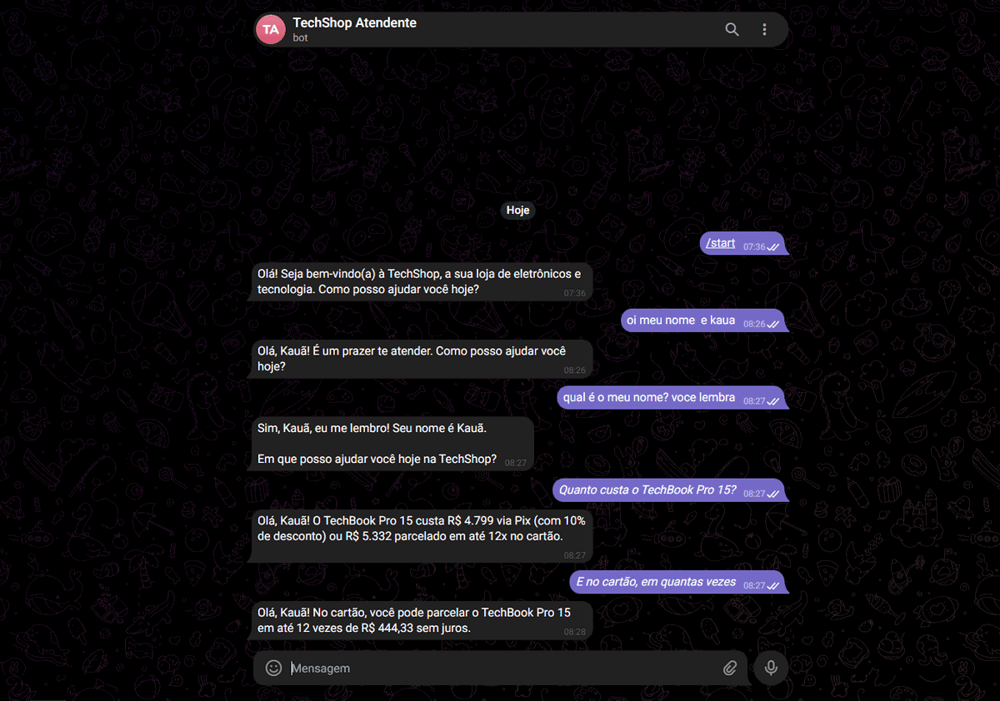
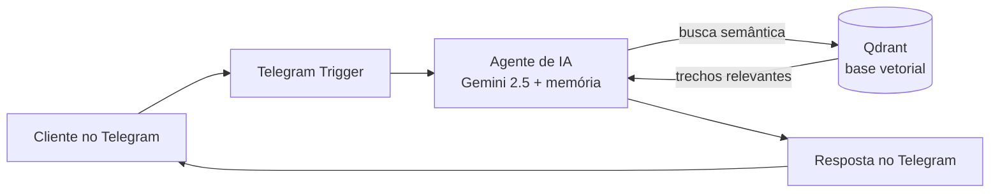

# 🤖 Atendente Virtual com IA no Telegram

Bot de atendimento que responde dúvidas de clientes de uma loja fictícia (a **TechShop**) direto no Telegram usando **RAG (Retrieval-Augmented Generation)**. Em vez de inventar respostas, a IA consulta a base de conhecimento da empresa (produtos, preços, políticas) e responde com base nela — admitindo quando não sabe e encaminhando para um atendente humano.


> **Projeto de estudo.** Construí este bot do zero pra aprender, na prática, RAG, agentes de IA e automação com n8n. O foco está na arquitetura e nas decisões — não é um produto pronto pra implantar.

## Demonstração

Conversa real com o bot no Telegram. Ele lembra o nome do cliente (memória da conversa) e responde com dados da base (RAG) — inclusive entendendo a pergunta de acompanhamento *"e no cartão, em quantas vezes?"* sem precisar repetir o produto:



## Como funciona



São dois fluxos no n8n:

**1. Ingestão** — lê os documentos em `knowledge-base/`, quebra cada um em pedaços (*chunks* de 1000 caracteres, com 150 de sobreposição), gera os *embeddings* com o Gemini e grava os vetores na coleção `techshop` do Qdrant. Roda uma vez, ou quando a base muda.

**2. Atendimento** — sempre ativo. A cada mensagem, o agente transforma a pergunta em *embedding*, busca os 4 trechos mais parecidos no Qdrant e usa esse contexto pra responder. A **memória por usuário** mantém o fio da conversa, e um *guardrail* no prompt garante que ele só afirme o que está na base; quando não acha, encaminha pra um humano.

## Stack

| Tecnologia | Papel no projeto |
|---|---|
| **n8n** `1.107.4` | orquestra os fluxos (low-code, self-hosted) |
| **Google Gemini** | LLM `gemini-2.5-flash` (chat) e `gemini-embedding-001` (embeddings) |
| **Qdrant** `1.15.1` | banco vetorial para a busca semântica |
| **Telegram** | canal de conversa com o cliente |
| **Docker Compose** | sobe n8n + Qdrant + túnel Cloudflare com um comando |

## Estrutura do projeto

```
.
├── docker-compose.yml        # n8n + Qdrant + túnel Cloudflare
├── knowledge-base/           # base de conhecimento da TechShop (Markdown)
│   ├── sobre-a-techshop.md
│   ├── produtos-e-precos.md
│   ├── entrega-e-frete.md
│   ├── pagamento-contato-e-horarios.md
│   └── trocas-garantia-e-devolucoes.md
├── workflows/                # fluxos do n8n
│   ├── ingestao.json         # indexa a base no Qdrant
│   └── atendimento.json      # recebe, busca e responde no Telegram
└── docs/                     # imagens do README
```

## Desafios e o que aprendi

O que parecia simples no diagrama rendeu uns problemas que me ensinaram bastante:

- **O embedding da busca tem que ser o mesmo da ingestão.** Minha primeira versão não retornava nada útil. O motivo: eu estava gerando os vetores da base com um modelo e consultando com outro. Como os vetores ficam em espaços diferentes, a distância entre eles não significa nada. Travei o `gemini-embedding-001` nos dois lados e a busca passou a fazer sentido.
- **O plano gratuito do Gemini tem limites traiçoeiros.** O `gemini-2.0-flash` me devolvia `429` com `limit: 0` nesse projeto — ou seja, cota zero, não dava nem pra testar. Troquei pelo `gemini-2.5-flash` e voltou a responder.
- **O Telegram não enxerga o `localhost`.** Pra receber as mensagens, o webhook precisa de uma URL pública. O túnel nativo do n8n (`--tunnel`) ficou instável aqui, então subi um `cloudflared` no Docker Compose, que publica uma URL temporária `*.trycloudflare.com` e entrega tudo pro n8n.
- **Fazer a IA admitir que não sabe.** O pulo do gato do RAG não é só buscar — é instruir o agente a responder *apenas* com o que a base retorna e, quando não acha, encaminhar pra um humano em vez de inventar. Isso vive no *system prompt* do agente e foi o que mais reduziu resposta errada.
- **Um guardrail rígido demais atrapalha.** A primeira versão do prompt dizia "não responda nada fora do universo da loja" — e o bot passou a recusar até lembrar o nome do cliente, mesmo com a memória funcionando. Aprendi a separar no prompt o que é *fato da loja* (só da base) do que é *contexto da conversa* (pode usar o histórico livremente).

## Credenciais

As variáveis sensíveis (chave de criptografia do n8n, token do Telegram e chave do Gemini) ficam só localmente: token e chave são cadastrados nas *credenciais* do próprio n8n, e o `.env` fica fora do repositório (`.gitignore`).
