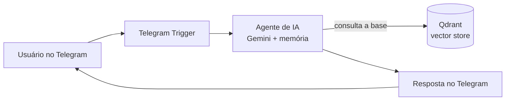

# Atendente Virtual com IA no Telegram

Bot de atendimento que responde dúvidas de clientes de uma empresa fictícia direto no Telegram. Em vez de inventar respostas, a IA consulta a base de conhecimento da empresa (FAQ, políticas, planos) e responde com base nela — e admite quando não sabe, encaminhando para um humano. A técnica por trás é **RAG** (Retrieval-Augmented Generation).

> **Status:** em desenvolvimento — Etapa 1 de 5 (infraestrutura e ambiente).

## Como funciona



São dois fluxos no n8n: um de **ingestão** (lê os documentos da empresa, gera os embeddings e salva no Qdrant) e um de **atendimento** (recebe a mensagem, busca o contexto na base e responde).

## Stack

- **n8n** (self-hosted) — orquestração dos fluxos
- **Google Gemini** — modelo de linguagem e embeddings (plano gratuito)
- **Qdrant** — banco vetorial para a busca semântica
- **Telegram** — canal de conversa
- **Docker Compose** — sobe tudo com um comando

## Como rodar

### Pré-requisitos

- [Docker Desktop](https://www.docker.com/products/docker-desktop/) instalado e rodando
- Uma conta no Telegram e um bot criado no [@BotFather](https://t.me/BotFather)
- Uma chave de API do Google Gemini ([Google AI Studio](https://aistudio.google.com/apikey))

### Configuração

Crie um arquivo `.env` na raiz do projeto com a chave de criptografia do n8n:

```env
N8N_ENCRYPTION_KEY=<gere_uma_chave_aleatoria_longa>
```

Para gerar a chave (PowerShell):

```powershell
[Convert]::ToBase64String((1..32 | ForEach-Object { Get-Random -Maximum 256 }))
```

> O `.env` fica apenas na sua máquina e é ignorado pelo Git. O token do Telegram e a chave do Gemini **não** vão no `.env`: eles são cadastrados nas *credenciais* do próprio n8n (interface), que ficam criptografadas no volume do container.

### Subir o ambiente

```bash
docker compose up -d
```

O n8n abre em http://localhost:5678. Na primeira vez, crie a conta de dono (owner) para proteger o acesso.

## Segurança

Segredos nunca entram no Git. A proteção é em camadas: `.gitignore` cobrindo `.env` e dados dos containers, varredura de segredos com **Gitleaks** (hook de pre-commit local + GitHub Actions a cada push) e portas expostas só em `localhost`. Mais detalhes nos arquivos [`.gitleaks.toml`](.gitleaks.toml) e [`.github/workflows/security.yml`](.github/workflows/security.yml).

## Licença

[MIT](LICENSE)

---

Feito por **Kauá Fernando Melo** — [github.com/kauafernandomelo](https://github.com/kauafernandomelo)
